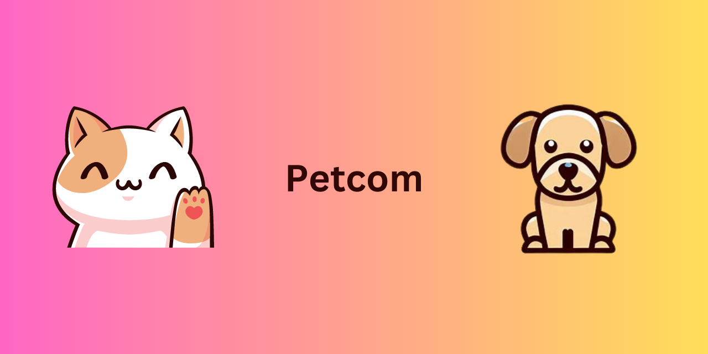

# Petcom

A community application for pet lovers and advocates working for pet and animal welfare.

## Table of Contents:

- [Screenshots](#screenshots)
- [About](#about)
- [Tech Stack](#tech-stack)
- [Features](#features)

## Screenshots:

## About:

A community application for pet lovers and advocates working for pet and animal welfare. Here you can create various communities and post on the topics related to it. You can also upvote the posts, reply to comments like the comments and so much more. We created this application so that people who love pets and contibute to their welfare can have a specific destination to get information about various things depending upon the community.

## Tech Stack:

Front End: Next.js 13, TailwindCSS, Shadcn/ui

Back End: Prisma, PlanetScale, TypeScript, Uploadthing, Upstash Redis

## Features:

- Infinite scrolling for dynamically loading posts
- Authentication usingThirdWeb
- Custom feed for authenticated users based on what community they have joined
- Advanced caching using Upstash Redis
- A beautiful and highly functional post editor
- Image uploads & link previews using uploadthing
- Full comment functionality with nested replies, Upvoting them
- Up Voting and Down Voting for Posts
